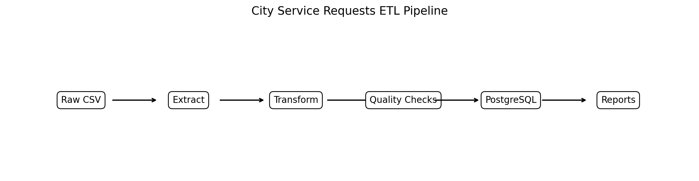
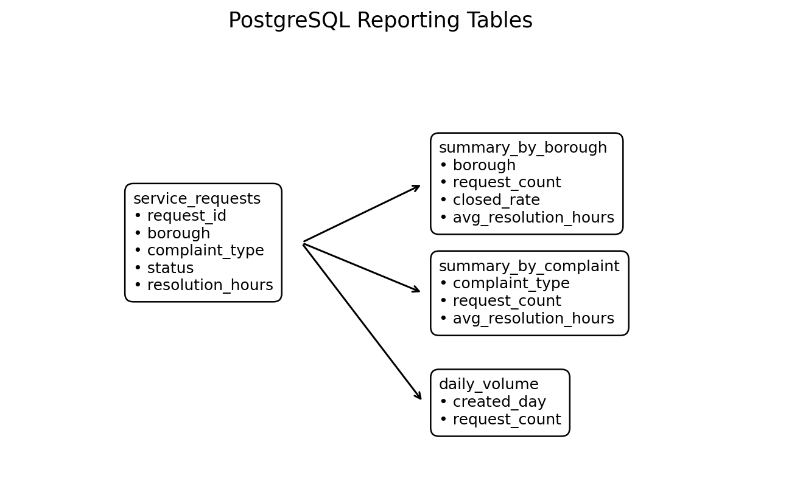

# CityPulse ETL
### PostgreSQL Data Pipeline for Urban Service Request Analytics

CityPulse ETL is a Python and PostgreSQL data engineering project that turns raw 311-style service request records into clean, validated, analytics-ready tables.

The project is designed around a realistic civic operations problem: city agencies receive thousands of requests across complaint categories, boroughs, and time periods, but the raw data is messy and difficult to analyze directly. This pipeline standardizes that data, applies quality checks, loads it into PostgreSQL, and produces summary tables and visuals that help answer operational questions.

This project began as a transit ridership ETL idea, but I changed the scope after realizing that reliable MTA ridership data was harder to access consistently. I kept the same data engineering goal—building a practical ETL pipeline around public-sector operations—but moved to a service-request dataset that is easier to run locally and explain clearly.

---

## Visual Overview





---

## What This Project Demonstrates

- Modular Python ETL design
- CSV extraction and schema normalization
- Pandas-based transformation logic
- Data quality checks before database load
- PostgreSQL table loading with indexes
- Reporting tables for analysis-ready outputs
- SQL queries for operational analysis
- Docker-based local database setup
- Basic automated tests for transformation logic
- Clear documentation of assumptions and tradeoffs

---

## Pipeline Overview

```text
Raw Service Request CSV
        ↓
Extract Layer
        ↓
Transform + Feature Engineering
        ↓
Data Quality Checks
        ↓
PostgreSQL Load
        ↓
Reporting Tables + Visual Outputs
```

The pipeline keeps the structure simple enough to run locally, while still resembling the kind of pattern used in real analytics engineering workflows.

---

## Core Questions the Pipeline Answers

- Which boroughs generate the highest request volume?
- Which complaint categories appear most frequently?
- What percentage of requests are closed?
- Which complaint types take longest to resolve?
- What time of day do requests tend to arrive?
- Which request categories should be treated as priority issues?
- Are there duplicate IDs, missing dates, or invalid resolution times?

---

## Outputs

After running the pipeline, the project creates:

```text
data/processed/service_requests_clean.csv
outputs/data_quality_report.csv
outputs/pipeline_summary.txt
outputs/requests_by_borough.png
outputs/top_complaint_types.png
outputs/daily_request_volume.png
outputs/resolution_buckets.png
assets/etl_architecture.png
assets/postgres_schema.png
```

It also creates these PostgreSQL tables:

| Table | Purpose |
|---|---|
| `service_requests` | Cleaned request-level data |
| `summary_by_borough` | Borough-level volume, closure, and resolution metrics |
| `summary_by_complaint` | Complaint-level frequency and resolution metrics |
| `daily_volume` | Request counts by date |
| `hourly_volume` | Request counts by hour |
| `resolution_buckets` | Resolution speed categories |

---

## PostgreSQL Schema

The main table stores cleaned service request records with derived fields such as:

- `created_day`
- `created_hour`
- `day_of_week`
- `is_weekend`
- `is_closed`
- `resolution_hours`
- `resolution_bucket`
- `priority_flag`

Indexes are created on common query fields:

- borough
- complaint type
- created day
- status

This makes the database more useful for recurring analysis queries.

---

## How to Run Locally

### 1. Install Python dependencies

```bash
python -m pip install -r requirements.txt
```

### 2. Start PostgreSQL with Docker

```bash
docker compose up -d
```

Default local connection settings:

```text
POSTGRES_HOST=localhost
POSTGRES_PORT=5432
POSTGRES_DB=city_requests
POSTGRES_USER=city_user
POSTGRES_PASSWORD=city_password
```

You can override these through environment variables or by referencing `.env.example`.

### 3. Run the ETL pipeline

```bash
python scripts/run_pipeline.py
```

### 4. Query the database

```bash
python scripts/query_database.py
```

### 5. Run tests

```bash
pytest
```

---

## Repository Structure

```text
citypulse-etl/
├── assets/
│   ├── etl_architecture.png
│   └── postgres_schema.png
├── data/
│   ├── raw/sample_311_service_requests.csv
│   └── processed/
├── docs/
│   ├── data_dictionary.md
│   ├── interview_guide.md
│   └── pipeline_walkthrough.md
├── outputs/
├── scripts/
│   ├── run_pipeline.py
│   └── query_database.py
├── sql/
│   ├── schema.sql
│   └── example_analysis_queries.sql
├── src/
│   ├── config.py
│   ├── data_quality.py
│   ├── extract.py
│   ├── transform.py
│   ├── load.py
│   └── reporting.py
├── tests/
│   └── test_transform.py
├── docker-compose.yml
├── requirements.txt
└── README.md
```

---

## Design Decisions

I kept the project focused on a practical, explainable ETL workflow instead of adding unnecessary infrastructure.

- **CSV input** keeps the project reproducible without relying on unstable APIs.
- **PostgreSQL** makes the project closer to real reporting and analytics workflows than a flat-file-only pipeline.
- **Pandas** keeps transformation logic readable and easy to validate.
- **Docker Compose** makes the database setup repeatable.
- **SQL files** document the intended warehouse structure and analysis queries.
- **Data quality checks** catch common issues before reporting.
- **Matplotlib outputs** provide lightweight visual reporting without requiring a web app.

---

## Limitations

This project uses a small sample dataset so the full pipeline can be run locally.

A production version would likely add:

- incremental loading
- orchestration with Airflow or Prefect
- schema migrations
- stronger validation with Pandera or Great Expectations
- a live API or scheduled ingestion source
- deployment to a cloud database

The current version is intentionally scoped as a focused data engineering prototype rather than a full production platform.

---

## Future Improvements

Planned or possible extensions:

- connect to NYC Open Data API
- add incremental append loads
- build dbt models for reporting tables
- add GitHub Actions for tests
- add a Streamlit dashboard
- add partitioning for larger datasets
- add slowly changing dimension examples

---

## Author

**Zachary Amachee**  
CIS @ Baruch College  
Data Engineering • Python • PostgreSQL
